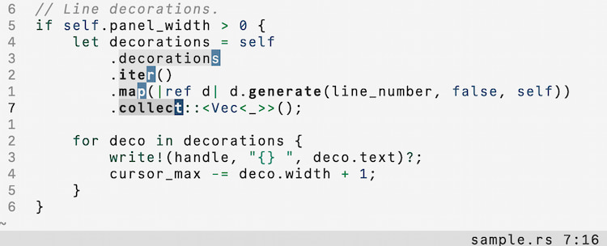
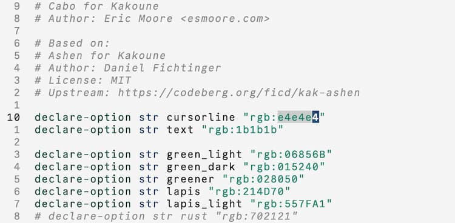

# Cabo for Kakoune

Bright and subtle colors for Kakoune, inspired by sea mist
and foam.

Based on the structure of [Ashen](https://ashen.style) by Daniel
Fichtinger.

## Installation

Download [cabo.kak](./colors/cabo.kak) and move it to your
`$kak_config/colors` directory.

Enable Cabo with the command `:colorscheme cabo` or by adding
`colorscheme cabo` to your kakrc.

## Notes

- `kak-lsp` support built-in
- `kak-tree-sitter` not planned
